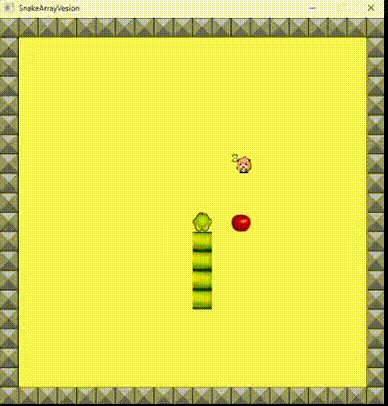

# EasyX_SnakeGame

  
  
<em>项目运行演示视频</em>

  

## 📖 项目概述

这是一款基于 **C++** 开发的经典贪吃蛇游戏。项目深度利用 **EasyX 图形库** 与 **Windows 消息机制**，实现了流畅的双缓冲渲染与创新的鼠标四象限交互模式。通过精细的逻辑设计，解决了传统 2D 游戏常见的画面撕裂与输入延迟问题。

---

## 🛠️ 核心技术亮点

### 1. 图形渲染与性能优化
- **双缓冲渲染 (Double Buffering)**：利用 `BeginBatchDraw` 和 `EndBatchDraw` 机制，在内存中完成图形绘制后一次性输出至屏幕，彻底消除了画面闪烁与撕裂现象。
- **透明贴图算法**：通过自定义 `drawImage` 函数，结合 **Alpha Blending (像素混合)** 原理处理图像 Alpha 通道，实现了丝滑的透明背景纹理叠加。

### 2. 交互逻辑设计 (Input Architecture)
- **异步消息驱动**：采用 `peekmessage` 异步截获系统消息，确保在处理高频鼠标移动（`WM_MOUSEMOVE`）及点击事件时，游戏逻辑主循环（Update Loop）不受阻塞。
- **象限判别转向算法**：基于数学向量偏移逻辑，通过计算点击坐标与蛇头的相对位移（Δx, Δy），利用绝对值比较算法实现直观的鼠标指向性转向。

### 3. 游戏引擎逻辑
- **蛇身跟随逻辑**：采用动态数组（或容器）管理蛇体坐标序列，实现了经典的一阶递归式位置更新。
- **碰撞检测系统**：基于 **AABB (轴对齐包围盒)** 算法，实现了苹果采集判定、边界溢出检测以及蛇身自碰撞的实时检测。

---

## 🎮 控制指南

### ⌨️ 键盘模式
使用方向键 `↑` `↓` `←` `→` 实时控制蛇的移动。

### 🖱️ 鼠标模式
- **左键点击**：点击蛇头周围的四个象限，蛇会自动转向对应的点击方向。
- **右键功能**：在游戏结束（Game Over）状态下，右键点击可实现**一键重启**。
- **视觉交互**：光标样式会根据其相对于蛇头的相对位置**动态变换**，为玩家提供直观的引导反馈。

---

This is a classic Snake game developed in C++ using the EasyX graphics library. Based on the traditional Snake game, this project implements a dual control interaction mode using both keyboard and mouse through the Windows messaging mechanism, and uses double buffering technology to ensure smooth and flicker-free graphics.

## 📖 Core Technology Highlights：

### Graphics Rendering and Performance Optimization: 

Utilizing BeginBatchDraw and EndBatchDraw to enable double-buffered rendering effectively solves common 2D game issues such as screen tearing and flickering. By customizing the drawImage function and using bitwise operations along with Bayesian theorem principles to process pixel Alpha channels, transparent background textures are achieved.

### Interaction Logic Design:

Message Pump Driven: Asynchronously obtaining user input through peekmessage ensures that game logic remains smooth even when handling high-frequency inputs (such as mouse movement).
Coordinate Quadrant Turning Algorithm: In mouse control logic, by calculating the relative position offset of the click coordinates to the snake's head (Δx, Δy) and comparing absolute values, the turning intent is determined, realizing an intuitive mouse click turning function.

### Game Engine Logic: 

Managing the snake's body coordinates with dynamic arrays implements the classic "snake body following" logic. Based on rectangular collision detection (AABB), apple collection detection, wall collision detection, and self-collision detection are achieved.

---

## 🎮 Control Guide：

### Keyboard Mode: 

Use arrow keys ↑ ↓ ← → to control the snake's movement direction.

### Mouse Mode:
- Left Click: Click the four quadrants around the snake's head, and the snake will automatically turn toward the clicked direction.
- Right Click Function: In the Game Over state, right-click to quickly restart the game.
- Mouse Movement: The cursor dynamically changes style based on its current position relative to the snake's head to guide operation.

